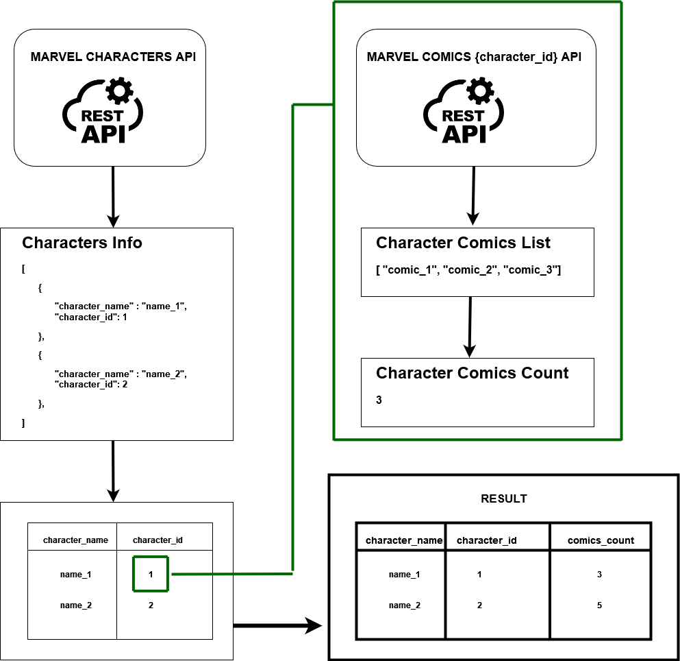
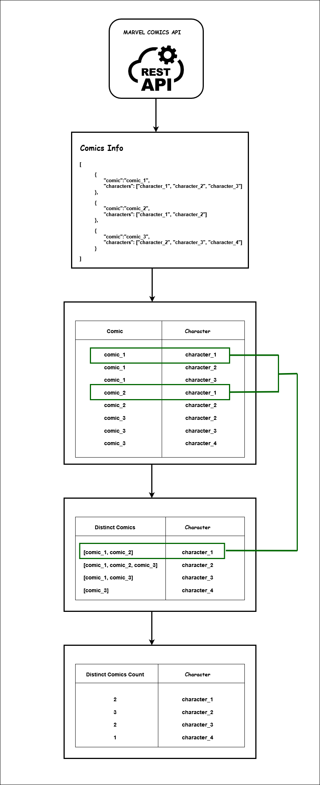

# Marvel API: Character Comics Analysis

This project implements a data pipeline that fetches data from the Marvel source APIs, which provide detailed information about characters, comics, and related entities. The pipeline processes and aggregates this data using Polars, a fast DataFrame library designed for high-performance data manipulation. After fetching the raw data, Polars is used to efficiently aggregate and transform the data, enabling the generation of insights such as the count of distinct comics per character. The processed results are then returned through a FastAPI interface, allowing users to interact with the data and visualize key metrics in real-time.


## Endpoints

This API provides insights into the number of distinct comics associated with Marvel characters. It includes endpoints to retrieve data and visualize the results.


### 1. Fetch Comics Count from Characters




- **URL**: `/api/characters/comics-counts/from-characters`
- **Method**: `GET`
- **Description**: Fetch the count of distinct comics in which a character appears. Optionally filter results by character name and limit the number of results returned.

#### Query Parameters
| Name             | Type     | Description                                    | Optional |
|------------------|----------|------------------------------------------------|----------|
| `character_name` | `string` | Filter by character name (e.g., "Spider-Man"). | Yes      |
| `limit`          | `int`    | Limit the number of results returned.          | Yes      |

#### Example Request
```bash
GET /api/characters/comics-counts/from-characters?character_name=Spider-Man&limit=5
```

### Example Response

```json
[
    {
        "character_name": "Wolverine",
        "comics_count": 300
    },
    {
        "character_name": "Thor",
        "comics_count": 250
    }
]
```

## 2. Fetch Comics Count from Comics





- **URL**: `/api/characters/comics-counts/from-comics`
- **Method**: `GET`
- **Description**: Fetch the count of distinct comics for characters based on comic data. Optionally filter by character name.

### Query Parameters

| Name             | Type     | Description                                   | Optional |
|------------------|----------|-----------------------------------------------|----------|
| `character_name` | `string` | Filter by character name (e.g., "Wolverine"). | Yes      |

### Example Request
```bash
GET /api/characters/comics-counts/from-comics?character_name=Wolverine
```

### Example Response
```json
[
    {
        "character_name": "Wolverine",
        "comics_count": 300
    },
    {
        "character_name": "Thor",
        "comics_count": 250
    }
]
```

## 3. Visualize Comics Counts

- **URL**: `/visualize/comics-counts`
- **Method**: `GET`
- **Description**: Generates a vertical bar graph that visualizes the count of distinct comics for characters.
  - The x-axis represents character indices.
  - The y-axis represents comic counts.
  - A legend box displays character names.

### Query Parameters

| Name             | Type     | Description                                    | Optional |
|------------------|----------|------------------------------------------------|----------|
| `character_name` | `string` | Filter by character name (case-insensitive).   | Yes      |

### Example Request

```bash
GET /visualize/comics-counts?character_name=Spider-Man
```

### Example Response

**Returns**: A PNG image of the graph:
- **x-axis**: Character indices
- **y-axis**: Comic counts
- **Legend**: Character names listed on the side

---

## Error Handling

| Status Code | Description                                         |
|-------------|-----------------------------------------------------|
| `200`       | Success. Returns the requested data or visualization. |
| `500`       | Internal server error. Indicates a data-fetching issue. |

### Example `500` Response
```json
{
    "detail": "An unexpected error occurred during processing."
}
```

## Development Notes

- **Framework**: FastAPI
- **Utilities**:
  - `get_comics_count_from_characters`: Fetches comics counts based on character data.
  - `get_comics_count_from_comics`: Fetches comics counts based on comic data.
  - `plot_comics_count_bar_graph`: Utility to generate bar graph visualizations.


---


## Project Setup and Running Instructions

### Prerequisites

Ensure you have the following installed on your machine:

- Python 3.9 or higher
- `pip` for installing Python dependencies

### Setting Up the Project

Follow these steps to set up and run the project:

#### 1. Clone the Repository
Clone this repository to your local machine using the following command:

```bash
git clone https://github.com/khaoulabenali/marvel-api-assignment.git
cd marvel-api-assignment
```

#### 2. Activate the Virtual Environment

The project includes a pre-configured virtual environment named marvel_test_venv. Activate it with the following commands:

##### On Windows:


```bash
marvel_test_venv\Scripts\activate.bat
```

##### On MacOS/Linux:


```bash
source marvel_test_venv/bin/activate

```

#### 3. Install Dependencies

Once the virtual environment is activated, ensure all required dependencies are installed:

```bash
pip install -r requirements.txt
```
#### 4. Set Up Environment Variables

The project requires specific environment variables for accessing the Marvel API. These variables should be set in a `.env` file located in the root directory of your project.

1. Create a `.env` file (if it doesn't already exist) in the project root folder.
2. CCopy the content of `.env.sample` to your  `.env` file, replacing the placeholders with your Marvel API keys:

```plaintext
MARVEL_API_PUBLIC_KEY = "your_public_key"
MARVEL_API_PRIVATE_KEY = "your_private_key"
```

#### 5. Run the Project

To run the project, you can use the provided `run.bat` script. This script simplifies the process of activating the virtual environment and starting the FastAPI server.

##### On Windows:
- Double-click the `run.bat` file, or run it from the command prompt:
```bash
run.bat
```

##### On MacOS/Linux:
If you don’t have a `.bat` script, you can manually activate the virtual environment and run the server with:

```bash
source marvel_test_venv/bin/activate  # Activate the virtual environment
uvicorn app.app:app --reload         # Start the FastAPI server
```

#### 6. Access the API

Once the server is running, you can access the API at the following URLs:

- **Interactive API Documentation**: [http://127.0.0.1:8000/docs](http://127.0.0.1:8000/docs)
- **Swagger UI**: [http://127.0.0.1:8000/redoc](http://127.0.0.1:8000/redoc)

---

#### 7. Stop the Server

To stop the server, press `Ctrl+C` in the terminal where it is running.

---

### Troubleshooting

- **Server not starting**: Ensure the virtual environment is activated and all dependencies are installed.
- **Virtual environment issues**: If activation fails, verify that the `marvel_test_venv` folder exists and contains the correct virtual environment structure.
- **Missing or corrupted virtual environment**: If the virtual environment is missing or not functioning, recreate it using the following commands:

```bash
python -m venv marvel_test_venv          # Create the virtual environment
source marvel_test_venv/bin/activate    # Activate on MacOS/Linux
marvel_test_venv\Scripts\activate.bat   # Activate on Windows
pip install -r requirements.txt         # Install dependencies
```